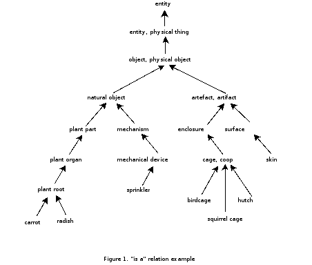
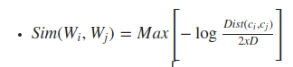

# Mjera semantičke sličnosti temeljena na čvorovima za skup podataka CroWN v1.0

U ovom projektu implementirana je Leacock-Chodorova semantička sličnost za riječi hrvatskog jezika. 
Korišteni skup podataka je CroWN v1.0.

Implementacija je napisana za programski jezik Python3.

### CroWN v1.0
Podatkovni skup nastao na Filozofskom fakultetu Sveučilišta u Zagrebu. 
Skup sadrži 10040 synsetova (skupova riječi koji su sinonimi), te preko 19147 riječi.
Svakom synsetu dodijeljen je i jedinstveni ID. Primjer IDja je `ENG30-15249799-n`.
Svaki synset može biti povezan s drugim synsetom određenom relacijom. Primjeri nekih 
relacija su hiperonimi, antonimi, osjećaji, holonimi, *biti u stanju* i slično.

**Važno je napomenuti** da skup podataka nije bio valjan gledajući relaciju *hiperonimi*
jer nije tvorio usmjeren, acikličkih graf. Problem je bio u synsetu pod IDjem `ENG30-03925226-n` te je on uklonjen. Navedeni synset je pokazivao da je on sam svoj hiperonim.

### Semantička sličnost temeljena na čvorovima
Riječi je potrebno preko neke relacije povezati u stablo. Primejer je relacija `hiperonim` 
u kojoj su čvorovi riječi (pojmovi), a usmjerene veze pokazuju na `hiperonim` pojedine riječi.
Takav graf čini usmjereno stablo. Primjer takvog stabla za engleski jezik prikazan je slikom ispod.


### Leacock-Chodorova sličnost
Jednadžba LC sličnosti prikazana je slikom ispod. `c1` i `c2` su oznake za riječi, dok 
je `Max` funkcija korištena jer je riječi moguće naći u više različitih čvorova stabla
(zbog toga što se pojedina riječ može nalaziti u više synsetova). Funkcija `Dist(c1,c2)`
je najkraća udaljenost između pojmova `c1` i `c2`, dok je `xD` u nazivniku najveća 
dubina stabla.



Važno je napomenuti da što su riječi semantički sličnije, to će mjera biti veća.

## Kako pokrenuti i koristiti program?
U naredbenoj ljusci potrebno je nalaziti se u izvršnom direktoriju projekta. Nakon toga
potrebno je pokrenuti `main.py` program. Primjer za linux:
`$ python3 main.py`

Nakon pokretanja program na standardni ulaz traži niz riječi napisanim isključivo malim
slovima te odvojenim zarezom.

Nakon toga prikazana je tablica s tri stupca. Prva dva stupca su uspoređene riječi, a u 
trećoj je prikazana izračunata mjera sličnosti.

## Rezultati
Za prethodno zadane riječi, dobiveno rješenje navedeno je ispod. Važno je primjetiti
da su riječi `računalo` i `miš` semantički vrlo slične (mjera 2.015), kao i riječi `mačka` 
i `miš` (mjera 2.015), dok su riječi `računalo` i `mačka` poprilično različite (mjera 0.762). 
```
Leacock-Chodorova slicnost:
+------------+-------------+----------+
| Prva rijec | Druga rijec | Slicnost |
+------------+-------------+----------+
|    pas     |    mačka    |  2.303   |
|    pas     |     ovca    |  1.322   |
|    pas     |     miš     |  1.792   |
|    pas     |  televizor  |  0.568   |
|    pas     |   računalo  |  0.693   |
|   mačka    |     ovca    |  1.455   |
|   mačka    |     miš     |  2.015   |
|   mačka    |  televizor  |  0.629   |
|   mačka    |   računalo  |  0.762   |
|    ovca    |     miš     |  1.455   |
|    ovca    |  televizor  |  0.457   |
|    ovca    |   računalo  |  0.568   |
|    miš     |  televizor  |  1.322   |
|    miš     |   računalo  |  2.015   |
| televizor  |   računalo  |  1.322   |
+------------+-------------+----------+
```

## Literatura
 - Raffaelli I, Tadić M, Bekavac B, Agić Ž. Building Croatian WordNet. Proceedings of
the 4th Global WordNet Conference; 2008, p. 349-359
 - Alexander Budanitsky, Graeme Hirst. Evaluating WordNet-based Measuresof Lexical Semantic Relatedness. University Of Toronto 